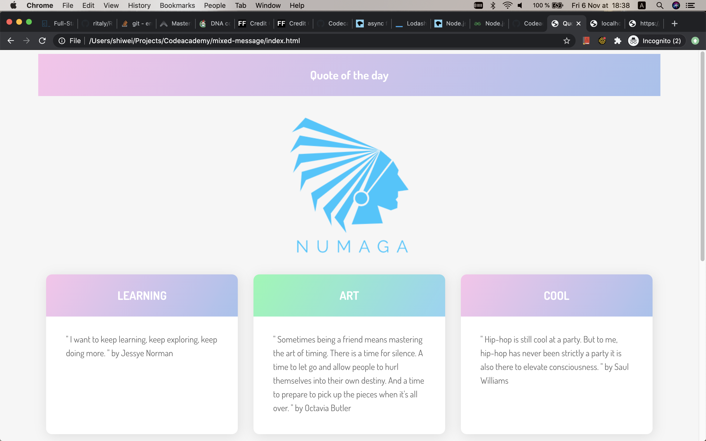

# **Mixed Messages**

In this project, you’ll build a message generator program that outputs a new, random message every time a user runs the program. Your program should
showcase basic JavaScript syntax and programming concepts.

## Table of contents

- [Overview](#overview)
- [Screenshots](#screenshots)
- [Prerequisites](#prerequisites)
- [Setup](#setup)
- [Features](#features)
- [Status](#status)
- [Inspiration](#inspiration)
- [Contact](#contact)

## Overview

For this project, you will build a quote generator program. Every time a user runs a program, they should get a new, randomized quotes.

## Screenshots

### Prerequisites

- JavaScript
- CSS
- HTML
- Git and GitHub
- Command line

## Setup

Going off platform: You will be doing this project outside of the Codecademy platform, on your own computer.

For this particular project, you will be using your own text editor (we suggest VSCode) and
[Git version control](https://www.codecademy.com/content-items/74bb71f3f3d5998245e9bbef934502d9). If you need a refresher on how to work with Git for
version control,
[review the Git lesson](https://www.codecademy.com/paths/full-stack-engineer-career-path/tracks/fscp-git-and-github-part-i/modules/fecp-introduction-to-git/lessons/git-workflow/exercises/git-generalizations)
or look at this [cheat sheet](https://education.github.com/git-cheat-sheet-education.pdf). You’ll also want to have
[Node set up locally](https://www.codecademy.com/articles/setting-up-node-locally) to be able to run your script.

## Code Examples

Show examples of usage:

1. open your terminal and pull the source code of this project by git

   `git clone https://github.com/NumagaConsulting/Codeacademy/tree/feature/mixed-message`

2. You have to [install node and local environment](https://www.codecademy.com/articles/setting-up-node-locally) to make the following step work as
   it's exptected.
3. open up terminal and go to the project directory
4. run the main.js to initilize the node server

   `node main.js`

5. your terminal should return 'Server is running on http://localhost:8000'`

6. you are good to go to index.html to check out the qutoes of the day.

## Features

List of features ready and TODOs for future development

- freshing up the index.html, you will be able to see some inspirational quotes with a beautiful layout.

To-do list:

- to be able to select the quote by genre or author

## Status

Project is in progress. When I learn more about front-end developement, I will come back to finished the feature that I can't accomplish currently.

## Inspiration

Add here credits. Project inspired by [Tania Rascia](https://www.taniarascia.com/how-to-connect-to-an-api-with-javascript/).

## Contact

Created by [@shiwei](mailto:shiwei1991@gmail.com) - feel free to contact me!
